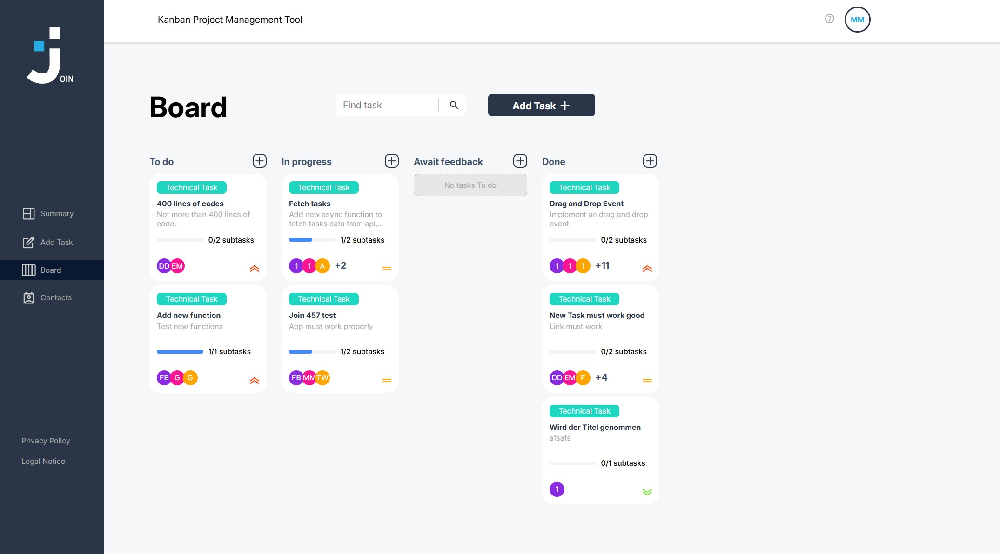

Join – Task & Contact Management App

Join is a modern task and contact management application built with HTML, CSS, and JavaScript using Firebase Realtime Database for backend data storage.

The application allows users to create, manage, edit, and organize tasks and contacts in an interactive and responsive interface.

Features
Create, edit, and delete contacts
Firebase Realtime Database integration
Task management system
Drag & Drop task board
Calendar and scheduling functionality
Task priorities and deadline tracking
Assign tasks to contacts
Responsive design for desktop and mobile devices
Dynamic rendering with JavaScript
Technologies Used
HTML5
CSS3
JavaScript (ES6)
Firebase Realtime Database
Learning Goals

This project was created to improve frontend development skills and gain practical experience with:

JavaScript application structure
DOM manipulation
Firebase integration
Responsive web design
Drag & Drop functionality
Dynamic data handling
User interface development

## Live Demo
https://marvin-mutwil.developerakademie.net/A-Developer-Akademie-Projekte/join457/login.html

## Preview

## Demo Videos

### Registration
https://github.com/user-attachments/assets/1c0279b0-3cf0-407c-888a-3f1adfb5d94e

### Login
https://github.com/user-attachments/assets/4be5765e-5ebf-4022-bb3e-ef283ef91fa8

### Summary
https://github.com/user-attachments/assets/3c660502-690f-4b16-92a1-e703883dee04

### Add Task
https://github.com/user-attachments/assets/1ea17dd4-6117-4bd8-b64a-ed7679444dc0

### Board
https://github.com/user-attachments/assets/3e56d9b6-453d-437f-9675-3f0d58fe2d8a

### Contacts
https://github.com/user-attachments/assets/b3f4f5aa-775f-4d40-93f4-1279aa7ec36b
